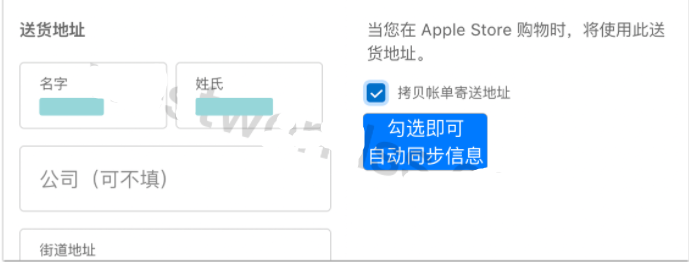

# 如何免费注册美区Apple ID，2022最新全网终极指南，亲测有效，轻松下载Shadowrocket
免费美区Apple ID分享,美区Apple ID注册教程,怎么注册美区Apple ID,国外Apple ID每日更新,Apple ID注册,Apple ID美国,Apple ID共享,Apple ID购买,美区Apple ID共享2022,美区Apple ID购买,美区Apple ID共享小火箭

### 为什么要注册美区Apple ID？每个人都有不同的答案，或许是为了下载Telegram聊天，又或者是为了下载Shadowrocket、Quantumult X、Surge 等app科学上网，总之拥有一个美区的Apple ID，能够方便快捷地替我们解决一些难题。

在这里给大家分享一个最新的**注册美区Apple ID**的方法，2022年亲测有效，而且过程不繁琐，很简单，堪称终极指南。

### 亲测安全稳定电脑/手机梯子官网：https://xbsj3462.fun/i/th037

## 第一步：打开 Apple ID的官网

在浏览器中输入该地址：https://appleid.apple.com/account

## 第二步：填写相关的注册信息

### 1、填写美国身份信息

● 很多小伙伴到这一步就懵了，不知道去哪里获取一个美国身份信息，这里给大家提供一个免费的获取美国身份信息网站，出自我经常使用的一家电脑梯子网站，能够提供正确的美国身份信息，而且都是免费的，只要你在网站上注册一个账号即可。

● 电脑梯子网址：https://xbsj3462.fun/i/th037

● 【打开该网站】------->【随意填写一个邮箱以及密码注册，登录】------->【点击网站左侧工具栏中的 <帮助>，选择 <美区Apple ID> ，页面下拉，找到下图位置点刷新即可】

---

---

---

● 将获取到的美国身份信息，填写到Apple ID注册界面，点击下一步。

### 2、设置登录信息

  ● 这一步很简单，就是设置你用来登录的信息。

    【邮箱】：输入你自己的邮箱地址
    【密码】：自己设置一个密码
    【确认密码】：再次输入相同密码
    【手机区号】：+86（中国大陆手机区号）
    【电话号码】：输入你自己的手机号

  ● 点击【继续】
  
## 第三步：验证邮箱和手机号

### 1、验证邮箱

● 输入注册时所填邮箱中收到的验证码，点击继续

### 2、验证电话号码

● 输入注册时所填手机号收到的验证码，点击继续

## 第四步：设置付款方式

### 1、添加付款方式

● 在验证完手机和邮箱之后，会自动进入该页面，点击页面中的【付款方式】，然后点击【添加付款方式】

### 2、填写付款方式

● 这一步又是卡住了很多人，这里付款信息的获取，还是用到上面第二步时我所提到的梯子网站，同样在该网站的【帮助中心】------->【美区Apple ID】页面中往下拉，有一个免费生成付款方式的按钮，点击【刷新】

---

---

● 需要注意的是，在填写付款方式页面，【国家或地区】一栏一定要选择‘美国’，【付款方式】一栏要选择‘无’，【楼号和单元】一栏不需要填写，其他按照上面生成的信息一一对应填写即可。

---

---

● 然后在下一步界面，勾选【拷贝账单寄送地址】

---

---

● 点击【更新】

---

---

## 第五步：在App Store登录

### 1、退出当前的Apple ID

● 在手机中打开Apple Store

  ---
  
  ---

● 点击右上角头像

---
 
---

● 拉到页面底端，点击【退出登录】

---
 
---

### 2、登录刚刚注册的美区Apple ID

● 在App Store中点击右上角头像

---
 
---

● 输入Apple ID 和 密码

● 点击密码下方的【登录】

---
 
---

● 点击【检查】

### 3、确认条款和支付方式

● 勾选【同意条款与条件】，点击【下一页】

---
 
---

● 不需要任何操作，直接点击【下一页】

---
 
---

### 4、成功使用Apple ID

● 到这一步，那么Apple ID 就是可以使用了，现在能够下载大陆地区无法支持的App，例如shadowrocket、telegram、TikTok等等。

● 备注：如果你需要下载付费的App，那么在大多数情况下，购买礼品卡进行充值就行，在淘宝搜索【苹果礼品卡】，购买时只要注意买美国区的礼品卡即可。
